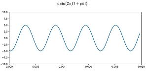
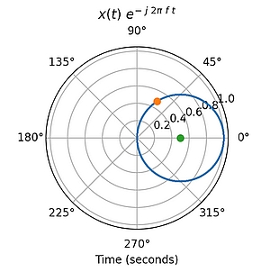
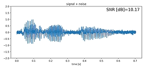
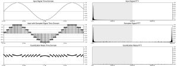
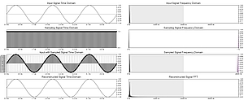
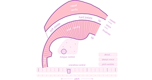

## Welcome to the intuitive Digital Signal Processing (iDSP) collaborative project
This page gathers *reactive* material for developing *intuition* in *Digital Signal Processing*.

Teaching indeed is a Communication Theory problem (and also of course a matter of presence, performance, humour, feeling etc.). How to best transfer information to students through the limited capacity of the speech and visual channels? A possible answer is: by using interactive, reactive images, which bring some sort of “biofeedback loop” and quickly make abstract concepts more accessible.

The material exposed here is organized into a list of figures which are usually proposed statically in textbooks, leaving considerable mental work on the student side to go from figure to concept. For each figure, we make our best to propose pointers to: 
1. **Reactive tools**, which are the heart if the project. They are webapps which require no specific installation to run. Tools augment the figure with reactive components which involve students in the understanding of the concept. Tools are open source.
2. **Videos**, which show how tools can be used to activate the figure. They are ideally snapshots of the tools, without spoken comments so as to let professors comment by themselves. Videos are Creative Commons.
3. **Code**, available for students with technical background to check how concepts are implemented and possibly build on this implementation. At best, code comes from the tools themselves (in which computational code should be isolated from graphical code)
4. **Papers**, when available, for a deeper understanding.

This material is taken from third parties when available (with their own licenses), or built on purpose.

If you want to contribute, or make suggestions or comments, [drop us a line](mailto://thierry.dutoit@umons.ac.be).

If you want to create an iDSP app using the python StreamLit library, see this [How-To guide](https://github.com/thierrydutoit/iDSP/blob/gh-pages/iDSP%20-%20HowTo.pdf).

---

| Figure     | iDSP content  |
| ---------- | ------------- | 
|  | [Sine wave](https://share.streamlit.io/thierrydutoit/sine-wave/main/sinus.py) / [Git](https://github.com/thierrydutoit/sine-wave)  |
|   | [Measuring time content](https://share.streamlit.io/thierrydutoit/dirac-as-a-limit/main/dirac.py) / [Git](https://github.com/thierrydutoit/dirac-as-a-limit)  |
|   | [Measuring frequency content](https://share.streamlit.io/thierrydutoit/scalar_product_periodic/main/scalar_product_periodic.py) / [Git](https://github.com/thierrydutoit/scalar_product_periodic)  |
|   | [Signal-to-Noise ratio (audio)](https://share.streamlit.io/thierrydutoit/snr-audio/main/snr_audio.py) / [Git](https://github.com/thierrydutoit/snr-audio)  |
|  | [Quantization and dithering] (https://idmil.gitlab.io/course-materials/mumt203/interactive-demos/quantization/) / [Video](https://www.youtube.com/watch?v=E5aPP7KB5F4) / [Git](https://github.com/idmil/dawb) / [Paper](https://dl.acm.org/doi/abs/10.1145/3478384.3478397) |
| <a href="https://idmil.github.io/DAWb/sampling/"> | [Sampling](https://idmil.gitlab.io/course-materials/mumt203/interactive-demos/sampling/) / [Video](https://www.youtube.com/watch?v=f5SKkB8GETk) / [Git](https://github.com/idmil/dawb) / [Paper](https://dl.acm.org/doi/abs/10.1145/3478384.3478397)  |
| <a href="https://dood.al/pinktrombone/"> | [Phonetic acoustics](https://dood.al/pinktrombone/) / [Video](https://www.youtube.com/watch?v=7LGnozlwU1o	) / [Git](https://github.com/IMAGINARY/pink-trombone/blob/master/index.html)   |

## The big picture
Below is a list of concepts we hope to see someday in this project. Some are available above at the time of writing these lines. Others are waiting for some good soul to be developed and shared. This list is open. Do not hesitate to [send a mail](mailto://thierry.dutoit@umons.ac.be) to provide your input.

- Periodic waveforms (ex : sinus, square, sawtooth, sinc, impulse) : a, f, phi 
- Power of a signal, RMS, an dBs. Link to audio norms for concerts
- Loudness. Measure perception from the listener, and [apply frequency compensation on a chirp for equal loudness perception](https://www.audiolabs-erlangen.de/resources/MIR/FMP/C1/C1S3_Dynamics.html)
- Simulate the audition after exposure to loud sounds without protection
- Simulate how very loud sounds are perceived when the ear distorts them (but do it on moderate loudness sounds)
- Sum of signals, including with opposite phase
- SNR on audio signals 
- SNR on images 
- Product of signals, vibrato, AM modulation
- Scalar product of signals with dirac impulses
- Scalar product of signals with phasors 
- Fourier as scalar product with phasors
- 1-D convolution + practical application 
- Convolution d’images et extension vers CNN
- Sampling (to be split into several experiments : sampling, aliasing, anti-aliasing filter)
- Uniform quantization (incl. dithering) 
- Shannon and signal reconstruction in the time and freq domains
- Real D/A conversion : zero-hold and smoothing filter
- More complex quantization schemes (A, mu, one bit …)
- Upsampling 
- Dowsampling 
- Oversampling and application
- Compressive sampling 
- Articulatory acoustics
- Linear prediction modeling and synthesis 
- Panning, binaural phase shifting, HRTFs for audio spatialization 
- Sub-band decomposition and reconstruction
- Sub-band coding, mp3
- Possibly extend to [neural nets](https://towardsai.net/p/machine-learning/introduction-to-neural-networks-and-their-key-elements-part-c-activation-functions-layers-ea8c915a9d9), HMMs,…

Existing material available from third parties can somehow be used for inspiration or for pointing to some demos

- Prof. Max Mignotte, DIRO, UMontréal has a [great repository of Java applets](http://www.iro.umontreal.ca/~mignotte/ift3205.html) (homemade or pointing to third party material)
- Prof. Daniel Russel has produced an [impressive collection of Mathematica demos on acoustics](https://www.acs.psu.edu/drussell/demos.html) (see this [video](mailto:https://idmil.gitlab.io/CIRMMT_visualizations/?/Instruments,%20Devices%20and%20Systems%20(RA1)/Musical%20Acoustics%20&%20Instruments/Daniel%20Russell) for a talk by the author)
- Math and physics Javascript-based demos are available [here](https://www.falstad.com/mathphysics.html)
- Signal processing Java demos can be found [here](https://pages.jh.edu/signals/) 
- [Reflections](https://coed.asee.org/2021/03/31/teaching-signal-processing-applications-using-an-android-echolocation-app), is an Android App for teaching autocorrelation via audio-based short range distance measurement (includes demo videos)
- Prof A. Spanias and colleagues have developed the [jDSP suite](https://coed.asee.org/2021/03/31/teaching-signal-processing-applications-using-an-android-echolocation-app), later ported to iphone/iPAD ([ijDSP](http://jdsp.asu.edu/ijdsp), and to Android ([AJDSP](https://play.google.com/store/apps/details?id=com.prototype.ajdsp1&hl=fr_CA&gl=US))
- [Spectroid](https://play.google.com/store/apps/details?id=com.pcmehanik.splspectrumanalyzer): a real-time spectrum analyzer on Android
- [PhyPhox](https://phyphox.org/) by TWTH Aachen, an excellent mobile lab (android & iOS). With [great videos on frequency and spectrum](https://phyphox.org/2021/05/) (audio, magnetic, acceleration). GPL source code available. 
- [Neural Networks from Scratch](https://nnfs.io/neural_network_animations) in Python 
- The excellent [online interactive book on DSP](https://jackschaedler.github.io/circles-sines-signals/dft_introduction.html) by Jack Schaedler with brilliant interactive animations (Javascript + Observable notebook using D3 as a data graphics lib).
- [Jupyter Notebooks on music processing](https://www.audiolabs-erlangen.de/resources/MIR/FMP/C0/C0.html) by the authors of a very good book on the topic.
- [Explained visually](https://setosa.io/ev), with an intuitive demo of [Markov chains](https://setosa.io/ev/markov-chains/)
- [https://vincmazet.github.io/spetsi/] Signal-relatd animations (in French) by Vincent Mazet (U. Strasbourg).
- [https://phyanim.sciences.univ-nantes.fr/index.php] Scientific animations (in French) by Geneviève Tulloue (U. Nantes)
  
##### Credits
 
The iDSP project was initiated by Profs. [Marcelo Wanderley (IDMIL, McGill)](http://www-new.idmil.org/people/marcelo-m-wanderley/) and [Thierry Dutoit (ISIA Lab, UMONS)](https://sites.google.com/view/thierrydutoit) during a 2-month sabbatical stay in Montreal (April-May 2022). 
Some of the material proposed here comes from the [IDMIL DSP Workbench](https://idmil.github.io/DAWb/) page, [Neil Thapen's game](http://venuspatrol.nfshost.com/) page, Jack Schaedler's brilliant [Seeing Circles, Sines, and Signals](https://jackschaedler.github.io/circles-sines-signals/index.html) pages.

